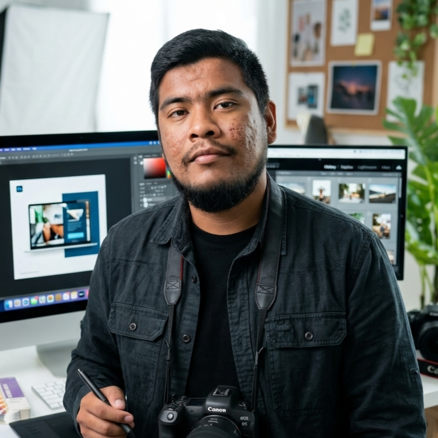

# Portafolio Creativo – Fotografía, Diseño e Ilustración

Sitio web personal tipo portafolio enfocado exclusivamente en disciplinas creativas. Diseño minimalista, moderno y responsive centrado en la exhibición visual.

## Estructura del proyecto

```
Practica2/
├── index.html          # Página principal (todas las secciones)
├── css/
│   └── styles.css      # Estilos, variables, animaciones, responsive
├── js/
│   └── script.js       # Navegación, scroll reveal, filtros portafolio
├── assets/             # Imágenes y recursos (crear y añadir tus archivos)
│   ├── foto-perfil.jpg # Foto para el Hero (recomendado: 400×400 px)
│   ├── portafolio/     # Imágenes destacadas de cada proyecto
│   └── galeria/        # Fotografías para la galería
└── README.md
```

## Secciones

1. **Hero** – Nombre, frase creativa, foto, CTAs (Ver portafolio / Contacto).
2. **Sobre mí** – Biografía centrada en la evolución artística y visión creativa.
3. **Portafolio** – Filtros por categoría (Fotografía, Diseño, Ilustración). Cada proyecto: imagen, concepto, herramientas y narrativa.
4. **Galería** – Grid de piezas visuales y fotografías artísticas destacadas.
5. **Habilidades** – Especializadas en imagen, diseño y herramientas digitales.
6. **Contacto** – Email, redes creativas (Behance, Dribbble, Instagram), CTA.

## Personalización

- **Nombre y título:** Busca "Tu Nombre" y "Tu Nombre Completo" en `index.html` y sustituye por el tuyo.
- **Email y redes:** En la sección Contacto, cambia `tu@email.com` y los `href="#"` por tus enlaces reales (LinkedIn, GitHub, Instagram, etc.).
- **Foto Hero:** En el Hero, reemplaza el bloque del placeholder por:
  ```html
  
  ```
- **Proyectos:** Edita cada `.portafolio-card`: títulos, descripciones, tecnologías y aprendizajes. Para usar imágenes reales, sustituye el `div.portafolio-placeholder` por ``.
- **Galería:** En cada `.galeria-item` puedes poner `` dentro del div (manteniendo el placeholder como fallback si quieres).

## Diseño

- **Paleta:** Neutros (#fafafa, #1a1a1a) y acento morado vibrante (#7C3AED). Editable en `:root` de `css/styles.css`.
- **Tipografías:** DM Sans (texto) y Playfair Display (títulos), cargadas desde Google Fonts.
- **Animaciones:** Reveal al hacer scroll y transiciones suaves en botones y tarjetas.

## Requisitos técnicos cubiertos

- HTML5 semántico y accesible (skip link, ARIA, landmarks).
- CSS con variables, responsive y animaciones ligeras.
- JavaScript vanilla: menú móvil, scroll suave, filtros de portafolio, observer para reveal.
- SEO básico: `meta description`, `title`, estructura de encabezados.

## Cómo ver el sitio

Abre `index.html` en el navegador o usa un servidor local:

```bash
# Con Python
python -m http.server 8000

# Con Node (npx)
npx serve .
```

Luego visita `http://localhost:8000` (o el puerto que uses).

## Próximos pasos

- Añadir tus fotos en `assets/` y enlazarlas en Hero, portafolio y galería.
- Sustituir textos de ejemplo por tu biografía y proyectos reales.
- Opcional: formulario de contacto (backend o servicio tipo Formspree).
- Publicar en GitHub Pages, Netlify o Vercel para tener la URL en línea.
